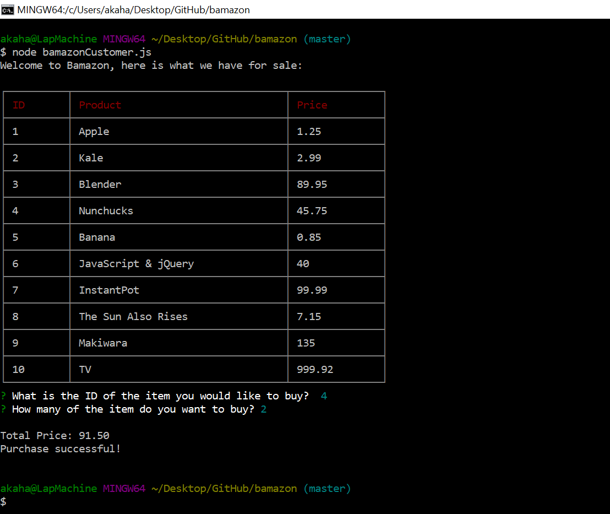
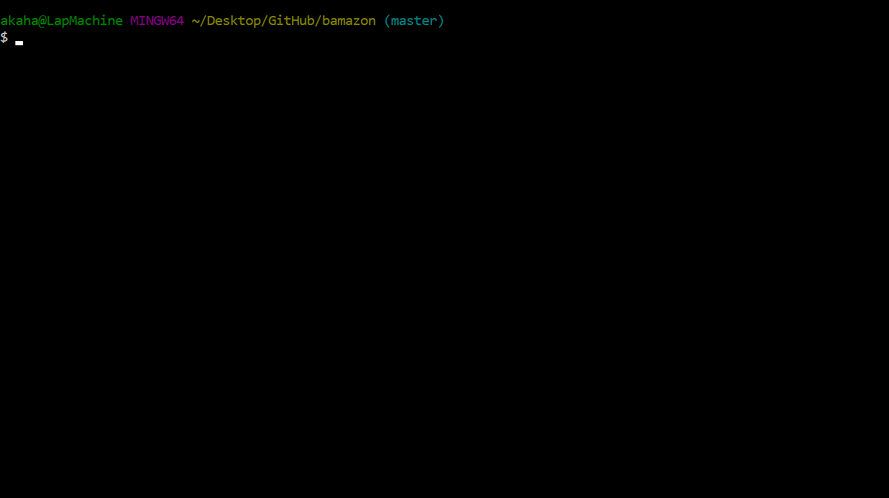

# bamazon

## Description
  A node auction board for you to pretend to buy and sell stuff.

## Install Instructions
  * Open your command line
  * Navigate to the path where you cloned bamazon
  * type `npm install` to install npm packages:
    *  inquirer
    *  mysql
    *  cli-table
    *  clear
  * type `node bamazonCustomer.js` to run the app

  ## Walkthrough
  1. The user will be shown a table of all available items, each with a unique ID
  2. The user will enter the ID of the desired item and the quantity that they would like.
    
  3. If the user enters a quantity that is higher than the quantity avaialable, they will get an INSUFFICIENT QUANTITY message will be prompted to make another choice.
    

